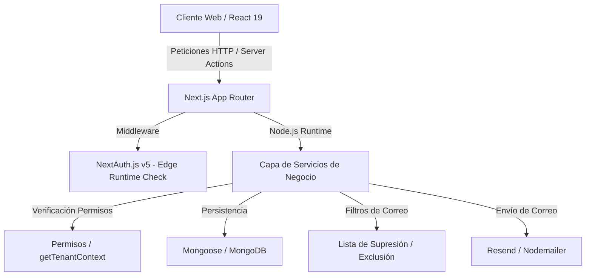

# Arquitectura del Sistema - CREATIX CRM

CREATIX-CRM se fundamenta en un diseño SaaS multi-inquilino (multi-tenant) con aislamiento de base de datos lógico (base de datos compartida, esquemas separados mediante identificador de organización).

## Capas de la Aplicación

### 1. Capa de Visualización y Ruteo (`src/app/` y `src/components/`)
La capa de presentación utiliza React Server Components (RSC) para cargas de datos iniciales rápidas directamente desde el servidor y Server Actions para operaciones de mutación e interacción asíncrona. Los componentes interactivos del cliente utilizan React Hooks, framer-motion para micro-interacciones, y componentes shadcn/ui.

### 2. Capa de Autorización y Contexto (`src/server/permissions/`)
Capa responsable de extraer e interceptar la sesión del usuario. 
- Valida que exista un `organizationId` asociado.
- Rechaza peticiones que no cuenten con la sesión del inquilino correspondiente.
- Nunca confía en un `organizationId` enviado desde los campos del frontend; siempre lo resuelve de forma segura a partir de la firma criptográfica del JWT de NextAuth.

### 3. Capa de Servicios de Negocio (`src/server/services/`)
Contiene las reglas de negocio de la plataforma independientes del controlador de peticiones. Aquí se gestiona:
- La creación y actualización de prospectos y contactos.
- La segmentación dinámica de listas mediante la compilación de reglas a consultas de MongoDB.
- Las lógicas de progresión de negocios comerciales y Kanban.
- Las validaciones de límites de plan.

### 4. Capa de Persistencia (`src/models/` y `src/server/database/`)
Mapea los documentos de MongoDB a interfaces de TypeScript fuertemente tipadas mediante Mongoose. Los modelos incluyen índices compuestos de filtrado organizados en torno a la clave `organizationId` para garantizar que la indexación de las consultas del inquilino sea rápida y eficiente.
