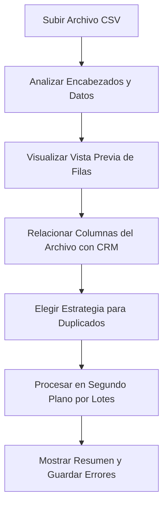

# Asistente de Importación de Datos - CREATIX CRM

El módulo de importación permite a los administradores cargar bases de datos masivas desde archivos CSV.

## Flujo de Importación Paso a Paso

### 1. Lectura y Vista Previa
El archivo CSV se lee utilizando `papaparse` para extraer los encabezados y las primeras 5 filas para una vista previa en la interfaz de usuario.

### 2. Mapeo de Campos (Mapping)
El usuario puede relacionar cada columna de su archivo con las propiedades de los modelos del CRM:
- **Campos de Empresa**: Nombre Comercial (`company.commercialName`), NIT/Identificación (`company.taxId`), Sector (`company.sector`), Ciudad (`company.city`), etc.
- **Campos de Contacto**: Nombre (`contact.firstName`), Apellido (`contact.lastName`), Correo (`contact.email`), Cargo (`contact.position`), etc.

### 3. Estrategias de Resolución de Duplicados
Antes de confirmar la importación, el usuario selecciona cómo actuar si se detecta un registro existente en la organización con el mismo correo electrónico o NIT:
- **Omitir Duplicados (`skip`)**: Se preserva el registro actual y se ignora la fila del archivo.
- **Actualizar Existentes (`update`)**: Se actualizan las propiedades del registro en base a la información del archivo importado.
- **Crear Nuevo (`create_new`)**: Inserta un registro nuevo de todas formas.

---

## Ejecución Asíncrona por Lotes

Las cargas de archivos grandes no bloquean las solicitudes web de la interfaz de usuario:
- El servidor registra el trabajo en la colección `ImportJob` en estado `'pending'` y responde al cliente de inmediato con un código 202 (Aceptado).
- Un hilo de fondo asíncrono inicia el procesamiento de las filas en lotes.
- Cada lote guarda el avance actualizando los campos `processedRows`, `createdCount`, `updatedCount` y `duplicateCount`.
- Si una fila tiene un error de validación (por ejemplo, correo electrónico mal escrito o NIT vacío cuando es obligatorio), la fila es omitida, se suma al contador `failedCount`, y los detalles del error se guardan en la colección `ImportRowError` para que el usuario pueda descargarlos en un reporte de errores.
